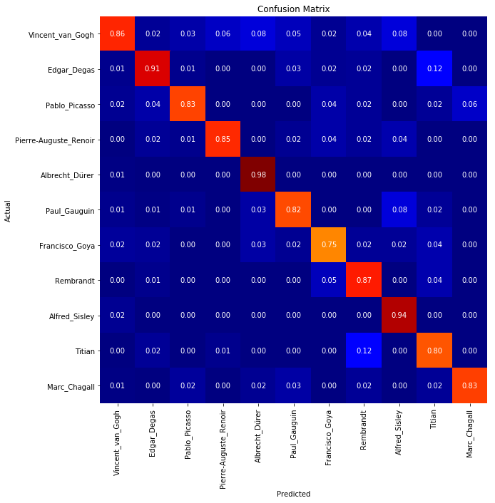
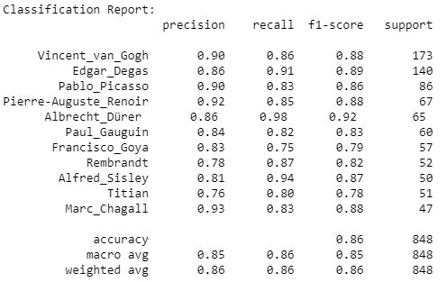

# Deep-Artist AI - Identifying Artists from Paintings Using Deep Learning

*Published · December 31, 2019*{.post-date}

---

> "I dream of painting and then I paint my dream." 
> Vincent Van Gogh

<!-- more -->

Creation of art is among the highest forms of expression of the human mind and imagination. The ability to communicate imagination sets humans apart from all other beings. Painting has attracted and connected brilliant human minds since the dawn of civilization. We have traveled a long way and have finally reached a stage where not only humans but computers are creating and understanding paintings.

For an art enthusiast, identifying the paintings of a favorite artist is not that difficult given years of careful practice. Given a painting, it can easily be identified if it was painted by a known genius. But can a computer do the same? Can a machine without emotions identify who the genius is behind a mindblowing painting? 

## The Problem Statement

Identifying an artist from a painting is a complex task. The human brain naturally picks up on subtle patterns in color and texture. For a computer, an image is just a massive grid of numbers. To bridge this gap, deep learning was utilized to see if a computer vision model could learn the distinct styles of some of the most famous artists in history. The goal was to build a system where an image is taken as input and the name of the artist is outputted.

## Gathering the Data

Collection of artworks of the 50 most influential artists of all time, scraped from artchallenge.ru during the end of February 2019. Special thanks to [Icaro](https://www.kaggle.com/ikarus777) for sharing this wonderful dataset! It can be downloaded from [Kaggle dataset section](https://www.kaggle.com/ikarus777/best-artworks-of-all-time).

A focus was placed on 11 artists who had the most paintings available in the data. This ensured the model had enough examples to learn from. 

Some artists had many more paintings than others. For example, Van Gogh had over eight hundred paintings, while others had only a few hundred. The training data had to be carefully balanced. If this was not done, the model might take a lazy approach and just guess the most common artist every single time.

## Pre-processing the Data

To reduce computation and better training, I decided to use the paintings of these 11 artists only.

Since this is an imbalanced datset (Van Gogh has 877 paintings whereas Marc Chagall has only 239), `class_weight` is important. Infact, it improved model performance substantially.

Keras `ImageDataGenerator` was used for data augmentation. This is not a traditional object detection problem, hence the augmentation approch should be used very carefully. I couldn't experiment in detail, but so far `zoom_range` worked well.

## Training the Model

A convolutional neural network based approach was utilized, beginning with a pre-defined architecture as a baseline. Multiple architectures were tested, but **ResNet50** yielded the best results. To help the model train more effectively, pretrained weights on _ImageNet_ were used through _transfer learning_.

The main objective is to identify the artist rather than the objects within the images. Because of this, the model needed to understand the underlying style and texture of the painting instead of focusing on the final object output. Based on careful experiments and observations, it became clear that training the shallow layers of the network is much more important than training the deeper layers. Additionally, training the model for more iterations might further improve performance, though this would require more computational resources and a longer training time.

Here is a simple flow diagram showing how the system works:

## Evaluating the Results

The final model performed very well. The artist was correctly identified for about 87% of the paintings that had never been seen by the model before. During the training phase, an accuracy of 99% was reached. This shows that computers can indeed learn to recognize art styles almost like a human expert.

### Confusion Matrix
_(NOTE: This image is best visible in light mode)_

{width="50%" align="center"}

### Classification Report
{width="50%" align="center"}

## The Code and Demo

- [Code to train the model](https://github.com/SupratimH/applying-ml-use-cases/tree/master/DeepArtist-Identify-Artist-From-Art)
- [Code of the web application](https://github.com/SupratimH/deepartist-web-application)
