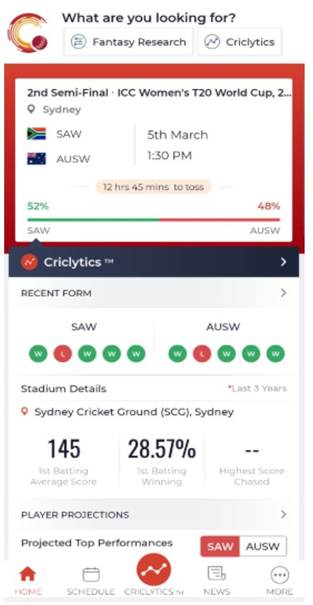
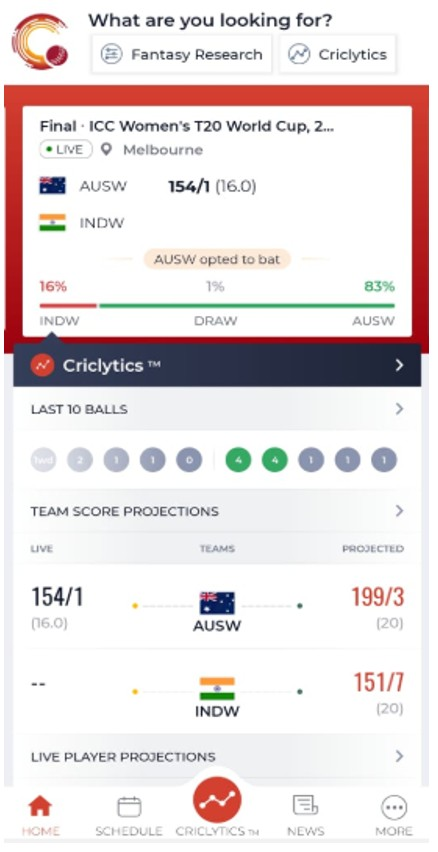
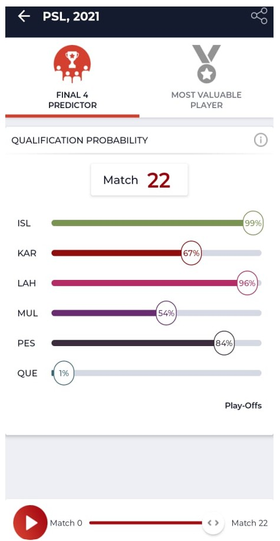
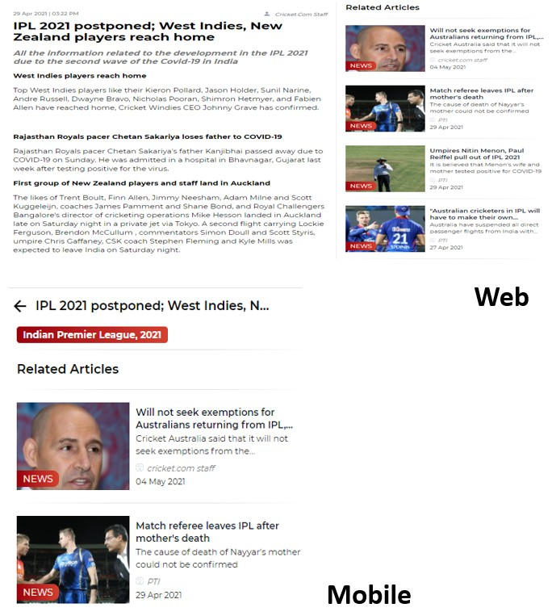
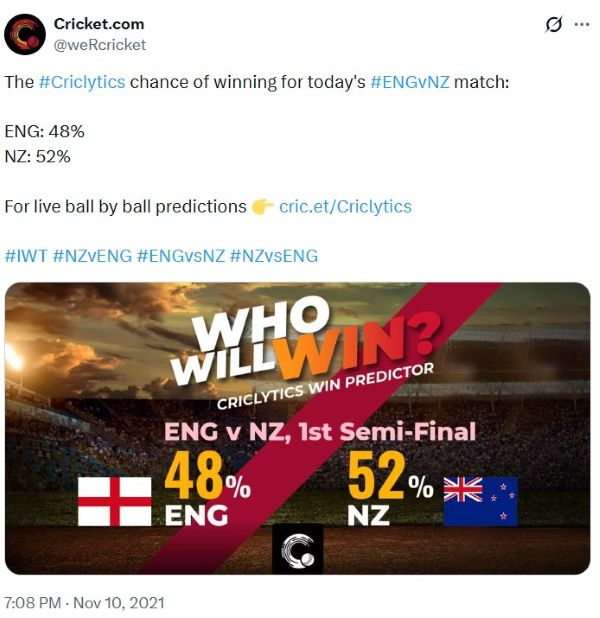
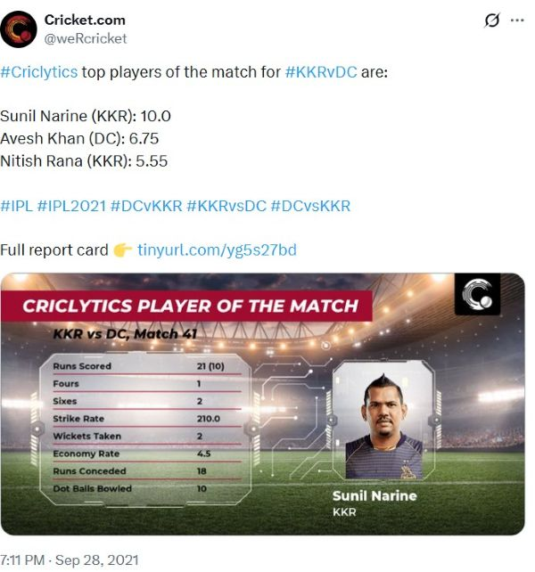

# What is Criclytics?

*Published · July 1, 2022*{.post-date}

---

**Criclytics** is a predictive analytics system built for cricket. It is the engine powering the predictive layer of _cricket.com_, a flagship product of _Head Digital Works Pvt. Ltd._

<!-- more -->

It uses historical match data, statistical models, and machine learning to answer one core question at different stages of a match:

**What is likely to happen next?**

Criclytics works across **T20, ODI, Test, and T10** formats, for both international and domestic cricket. It covers the full journey of a match:

* Before the match starts
* While the match is live
* After the match ends

Over time, Criclytics expanded into multiple supporting engines that improved fan engagement, content discovery, and social reach.

---

## Criclytics (Pre, Live and Post Match)

Criclytics is built around three stages of a cricket match.

### Pre-match Predictions

Before a match begins, Criclytics estimates:

* Team win probability
* Projected team score
* Player runs and wickets
* Key batter vs bowler matchups
* Team strength using a player and team rating system

These predictions are based on:

* Historical performances
* Player form
* Head-to-head history
* Rating parameters for teams and players

{width="40%" align="center"}

---

### Live-match Predictions

During the match, Criclytics updates predictions ball by ball.

It uses:

* Current score
* Strike rate
* Bowling average
* Balls remaining
* Target score
* Pre-computed team ratings

Machine learning classification and regression models keep updating:

* Win probability
* Projected runs
* Projected wickets
* Projected overs

A Monte Carlo simulation layer runs in the background to simulate:

* Player runs
* Wickets
* Partnerships
* Tie probability

This allows Criclytics to capture changing match situations with high sensitivity.

{width="40%" align="center"}

---

### Post-match Summary

After the match ends, Criclytics generates:

* Match stats
* Scoring charts
* Phases of play
* Match reel summary

This helps users quickly understand how the match evolved over time.

{width="40%" align="center"}

---

## FRC (Fantasy Research Center)

FRC was built as an extension of Criclytics for fantasy cricket users.

Using the same prediction and rating backbone, FRC helps users:

* Understand key player matchups
* Evaluate player form
* Build better fantasy teams using data
* Identify high impact players for a match

---

## Article Reco Engine

To improve content discovery, a simple but effective article recommendation engine was built.

When a user finishes reading an article, the system suggests similar articles.

This engine uses:

* TF-IDF vectors to represent article content
* Cosine similarity to find related articles
* A content-based recommendation approach

This significantly increased the average time users spent on the app.

{width="40%" align="center"}

---

## Twitter Auto Posts

Criclytics insights were also used to automatically generate and post images on Twitter at the right moments during a match.

These posts included:

* Key batter vs bowler matchups
* Toss update and win prediction
* Playing 11 announcement
* Fantasy best team
* Best player of the match

The images and tweets were generated programmatically and posted faster than manual updates, increasing engagement and traffic back to the platform.

{width="40%" align="left"}
{width="40%" align="left"}

---

## Challenges

Building Criclytics was not only about models. Some key challenges were:

* Handling live match data updates reliably
* Keeping predictions fast enough for real-time use
* Making complex predictions understandable to users
* Scaling the system across formats and matches
* Ensuring consistency between pre, live, and post match engines

---

Criclytics showed how data science can be applied to a fast moving sport like cricket in a practical and engaging way. It combined predictive models, simulations, content systems, and automation into one connected product experience.
