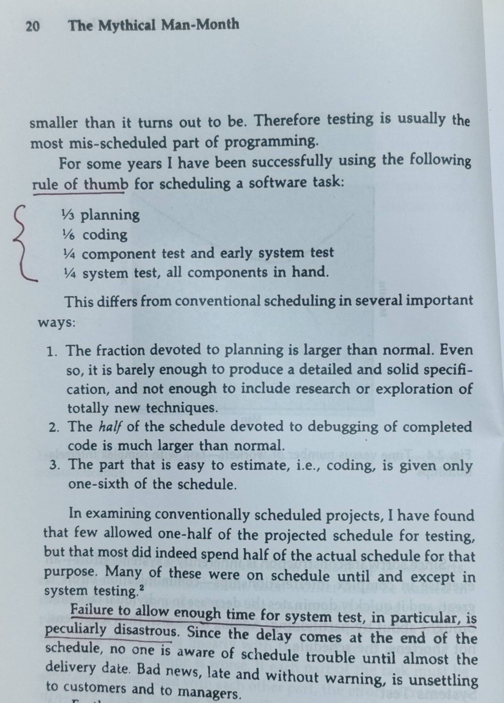

# The Discipline of Testing in the Age of Machine Learning

> What Fred Brooks knew that machine learning is still learning

Back in 1975, Fred Brooks, in his seminal work "The Mythical Man-Month" wrote - dedicate half the schedule for "testing". His was not a suggestion, but a rule of thumb from decades of hard experience building real software.

<!-- more -->

{ width="50%" align="center"}
/// caption
*Fred Brooks' rule of thumb for scheduling — The Mythical Man-Month (1975)*
///

## When Testing Was Non-Negotiable

Early in my career as a software engineer, even though we were always attracted toward the exciting part of development i.e. "coding", we gradually realized the importance of designing and executing tests, along with good documentation. It wasn't the most glamorous work, but it was the work that determined whether you could trust what you built.

That rigor is largely missing in machine learning. Not because people don't care, but because the problem is genuinely harder than anything Brooks was describing.

### The Contract Is Clear

In traditional software, the logic is explicit. You write a function, you know what it should return, and you test against that. If it does not work, you debug and fix the logic. In ML, the behavior is learned, not written. The model encodes patterns from data in ways that even its creators don't fully understand. There is no fixed output to assert against - only probabilities, distributions, and behavior that can quietly shift when the underlying world does.

## How ML Tests — And Where It Falls Short

So ML found its own version of testing - hold out some data the model hasn't seen, measure accuracy (and other metrics relevant to the problem), and try to estimate what that means for the business. It definitely works up to a point. But out-of-time sample performance is a proxy, not a guarantee. And business impact is even harder to pin down, because models can look right on every metric and still move the wrong needle in production.

### When There Is No Right Answer

Benchmarks, adversarial testing, drift detection - these are serious attempts at a hard problem. But they are still uneven and nowhere close to the shared discipline that software engineering has built over decades.

With systems built on LLMs the problem goes even further, because there is often no single correct output to benchmark against at all. Building that benchmark is a big challenge in itself. So it is often just degrees of better or worse. And that is a whole new level of unsolved!

## The Discipline Will Come — It Always Does

I think that discipline in software engineering did not emerge because the industry was thoughtful, rather because enough things broke in production, badly enough that there was no longer a choice. Predictive models has been in production long enough, and the pain is real. Perhaps we are finally beginning to take seriously what Brooks told us half a century ago.