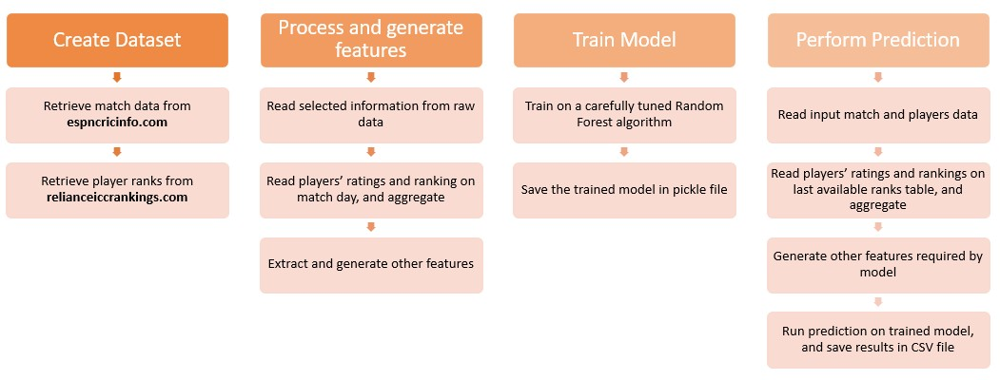

# Predicting Outcomes of Cricket Matches using Machine Learning - Overview and Architecture

*Published · Aptil 25, 2026*{.post-date}

---

Before the 2019 ICC ODI World Cup the thought appeared in my mind if ML can accurately predict the outcome of matches even before it starts. This was not just about guessing a winner but about testing a deeper hypothesis. Can the vast sea of historical sports data actually reveal the hidden variables that decide a match?

<!-- more -->

## The Hypothesis

Most fans view cricket as a series of unpredictable moments. We often hear that it is a game of glorious uncertainties. My hypothesis was different. I believed that while individual moments are random, the underlying probability of a team winning is grounded in measurable data. If we can quantify the current form of players, the historical momentum of a squad, and the specific advantages of a venue, we can build a profile that moves us closer to a predictable outcome. **This personal project, which is very dear to me, was born from that belief.**

At the intersection of data science and sports AI the biggest hurdle is rarely the algorithm itself. It is usually the data. Cricket data is notoriously fragmented. We have match summaries in one place, detailed ball by ball logs in another, and historical player rankings somewhere else entirely. To build a robust predictor we need a system that can ingest all these disparate sources, clean them, and engineer meaningful features that represent the actual state of a team on any given day.

Here is a look at the architecture that makes this possible.

## The Machine Learning Pipeline

The system is designed as a sequential pipeline with four main stages.

{ width="100%" align="center"}

## Data Ingestion

The first step is gathering the raw materials. The pipeline relies on custom web scrapers to pull historical match records from ESPNcricinfo. This includes venue details, toss outcomes, and playing squads.

Simultaneously it fetches historical player rankings from the Reliance ICC Rankings database. A critical design decision here is to always pull a player ranking from the exact day before the match in question. If we use their ranking from after the match we introduce data leakage into the model, which artificially inflates its accuracy during testing but fails in real world scenarios.

## Data Processing and Integration

Once the raw data is downloaded it must be integrated. This is where we encounter the classic data science problem of entity resolution. A player might be listed with initials in one database and their full name in another. The pipeline uses fuzzy string matching algorithms to resolve these discrepancies and create a unified profile for every player across all historical matches.

The processing stage also standardizes team names, removes invalid records, and structures the nested web data into clean tabular formats.

## Feature Engineering

This is the most important stage of any sports AI project. Raw data alone is rarely enough for an accurate prediction. We have to create features that capture the nuance of the sport.

The pipeline engineers several key indicators:

*   Team Strength: We calculate the average batting and bowling ratings of the playing eleven. We also look at the ratio of top 100 ranked players in the squad.
*   Current Form: We compute weighted moving averages of past wins for each team. Recent matches are given a higher mathematical weight to capture a team momentum.
*   Head to Head Records: Historical dominance matters. The system calculates the historical win ratio between the two competing teams.
*   Relative Metrics: Instead of just feeding absolute numbers to the model we calculate the difference between the two teams for various metrics. This explicitly highlights the relative strength gap.

To prevent the model from learning positional bias we augment the dataset by swapping the team order and flipping the target variable. This ensures the algorithm learns the underlying patterns of victory rather than just favoring the team listed first.

## Model Training

With a rich set of engineered features the final step is modeling. The pipeline uses a `Random Forest` classifier. This algorithm is highly effective for tabular data and handles non linear relationships well. It evaluates all our engineered features, finds the complex patterns that lead to victory, and generates a probability score for the upcoming match.

## Overcoming Technical Challenges

Every data science project comes with its own set of unique hurdles. In this project the challenges ranged from data scarcity to the complexities of player naming conventions. Here is how I addressed them.

| Challenge | Solution or Workaround |
| :--- | :--- |
| Training data is not sufficient | Duplicated the training data by swapping team 1 and team 2 along with their features to help the model learn better. |
| Winning probability must be symmetric when teams are swapped | During prediction every row is duplicated into two records. The system calculates probabilities for both and then takes the average to ensure consistency. |
| Very old matches are not indicative of modern game play | Skipped all match records from before 1990 in the training set to ensure the model focuses on the modern era of cricket. |
| Inconsistent player names across data sources | Used an open source library called whoswho as a base and customized it heavily to handle cricket specific naming conventions between ESPNcricinfo and Reliance ICC Rankings. |
| Determining the optimal window for team momentum | Settled on a weighted average of wins from the previous 7 matches for both individual team form and head to head history. |

## Conclusion

Just like with any other ML problem, building a successful sports prediction engine requires a structured pipeline that can resolve data inconsistencies and extract meaningful features. By combining rigorous engineering with machine learning we can move beyond simple intuition to a truly analytical approach for predicting match results.

## Performance on ICC ODI WC 2019 matches

Testing the model against the 2019 World Cup provided a real world validation of the pipeline architecture. From 5th June 2019 onwards the accuracy metrics were highly encouraging.

*   **Model Accuracy**: My model achieved an accuracy of 78.34% while Google stood at 75.66%.
*   **Probability Alignment**: In most matches the winning probabilities calculated by the system were closely aligned with Google.

There were a few interesting matches where the predictions differed:
*   **India vs Australia**: My prediction was incorrect.
*   **West Indies vs Bangladesh**: My prediction was correct.
*   **Sri Lanka vs West Indies**: My prediction was correct.

Beyond individual match results the system was able to simulate and correctly predict the top four standing and the semi final draws early in the tournament. [:material-open-in-new: Posted on X/Twitter on 25-Jun-2019](https://x.com/supratim_h/status/1147605969091776512){target="_blank"}

Finally the model predicted that the final match would be extremely close. As we all know it became one of the greatest matches in history and went all the way to a Super Over before England came out as the winner. You can see that prediction here: [:material-open-in-new: The final prediction on X/Twitter](https://x.com/supratim_h/status/1150348247170351104){target="_blank"}
